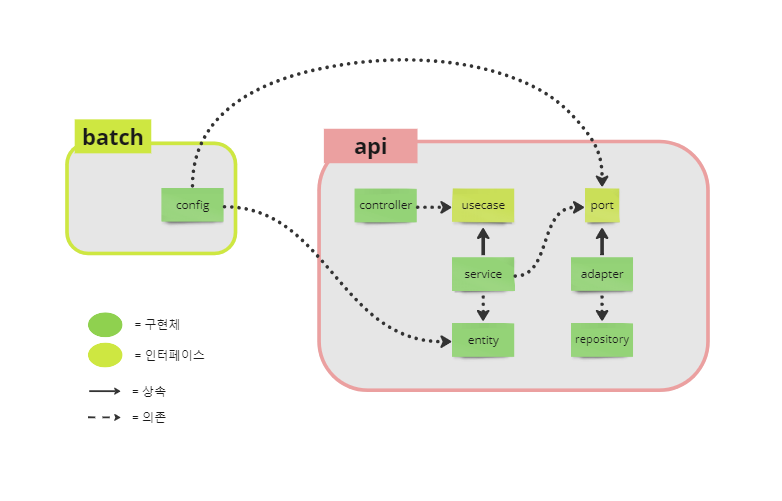
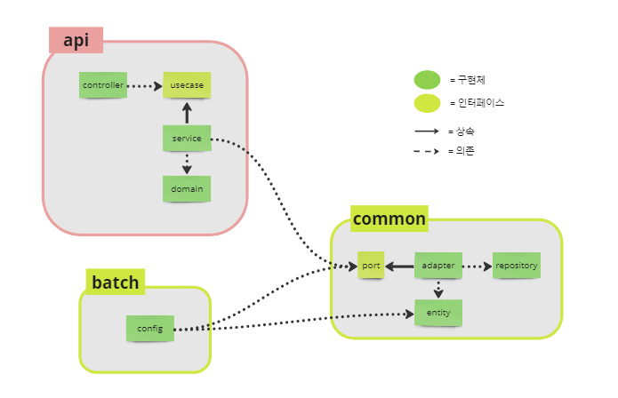
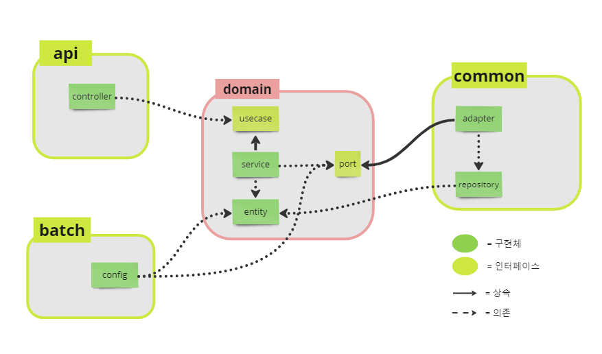
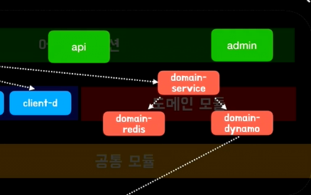

안녕하세요. 냉장고를 부탁해 프로젝트에서 백엔드 개발자를 맡고 있는 김도현입니다.

이번 글에선 저희 프로젝트에서 멀티 모듈을 적용해가는 일화를 소개해드리려고 합니다. 

먼저 개인 블로그에 미리 올렸던 글이라는 점 감안해주고 봐주시면 감사하겠습니다. 🙏🙏


우선 모듈 분리의 시작은 엔티티 문제였다..

프로젝트에서 우리는 api 서버(모듈)와 batch 서버(모듈), 2개를 운영하며 두 서버에서 모두 같은 MySQL DB에 접근하는 방식을 취하고 있었다.

또한 우리는 batch 모듈을 데이터 삭제나 알림을 전송할 때 사용하고 만들어진 알림을 api 모듈에서 조회하도록 구현했기 때문에 두 프로젝트에 모두 알림(notification) 엔티티를 지녀야했다. 그런데 이것이 문제의 불씨가 되었다.

## 문제 상황

문제는 다음과 같았다. 로컬에서 작업하는 팀원 중 누군가가 알림 엔티티를 변경하면 다른 팀원은 수기로 프로젝트의 엔티티를 동기화 해야했다. 하지만 이것이 잘 되지 않았고 `application.yml`에 `spring.jpa.hibernate.ddl-auto` 옵션을 `update`로 설정해두었기 때문에 어느 순간 메인 DB에 쓰기가 발생하였고 DB 내부 값이 꼬이게 되었다.


## 문제 해결

일단 당시 문제가 발생하기 전엔 멀티 모듈이 무엇인지 자세히 몰랐고 batch 서버 구축을 공부할 때 우연히 [이 글](https://jojoldu.tistory.com/123)을 발견하게 되었다. 혹시나 필요할까 싶어 공부와 실습을 미리 해둔 상태였다. 그런데 마침 위와 같은 문제가 발생하게 되었다.

위의 글의 내용에 따르면 멀티 모듈을 사용함으로써 공통으로 사용되는 코드를 모듈화할 수 있기 때문에 코드 변경시 수정되는 코드의 양을 줄일 수 있고 코드 동기화할 필요가 없기 때문에 동기화로 인한 실수를 없앨 수 있다고 한다.

> - 해당 블로그의 버전은  스프링 부트 1.5.x이기 때문에 현재 2.7 버전을 사용하는 우리 프로젝트와 맞지 않았다. 그래서 우리 프로젝트에 적용할 수 있는 [이 글](https://backtony.github.io/spring/2022-06-02-spring-module-1/)을 찾게 되었다.
- 한가지 더 알게 된 사실은 [이 글](https://awse2050.tistory.com/m/109)인데 여기서는 build.gradle의 implementation과 api 옵션으로 의존성의 개방과 폐쇠를 설정할 수 있다.
- 해결 방법을 설명하기 전에 우리는 api 모듈에 헥사고날 아키텍처를 사용하고 있으며 글과 그림을 번갈아 보며 이해해주길 바란다.

그리하여 해당 문제를 해결하고자 회의를 진행했고 회의 결과 두 단일 모듈을 합쳐 멀티 모듈로 변경하기로 했다.

### 멀티 모듈 - 1차

api와 batch 두 단일 모듈 중 공통으로 사용하는 코드를 모듈로 분리하는 것이 맞지만, 프로젝트에서 api의 비중이 매우 크고 바로 사용하기 위해 임시적으로 batch가 api를 의존하는 형태로 만들 자는 것이 나의 의견이었다.



그러나 이는 좋은 방법이 아니었다. batch 모듈은 api와 겹치는 entity와 일부 port만 사용하면 되는데 굳이 덩치가 크고 무거운 api의 전부를 의존하는 것은 맞지 않기도 하며 bulid 시 시간도 오래 걸리고 api와 의존성이 복잡하게 얽혀 있었다.

### 멀티 모듈 - 2차


그래서 다시 생각한 것은 api와 batch, 그리고 common을 두고 common에 데이터베이스와 외부 인프라에 관련된 것을 다 몰아 넣자는 생각이었다.



그런데 이렇게 개발을 진행하면 batch에서는 domain과 관련된 것들을 사용할 수가 없다. 이전에 api와 batch가 두 단일 모듈일 땐 두 모듈 모두 jpa를 사용하고 있었기 때문에 내부의 entity가 곧 domain이었다.

그러나 지금은 db와 infra 관련된 것을 모두 common으로 이동시켰기 때문에 entity는 domain과 entity로 나누어지게 된다. (domain은 api로 entity는 common으로 나누어진다.)

그래서 common만 의존하는 batch는 domain에 있는 enum 타입이나 부가적인 것들을 사용할 수 없게 된다.

이 방법도 좋은 설계가 아니라고 판단이 되었다.

### 멀티 모듈 - 3차

2차 멀티 모듈의 문제점을 해결하기 위해서 batch 모듈도 domain 모듈을 지나서 데이터베이스 영역인 common 모듈로 접근하는 방법으로 변경하였다. batch 모듈도 domain을 사용할 수 있도록 api 모듈에서 domain 과 관련된 코드를 따로 모듈로 분리했다.

그리고 domain 모듈에 jpa 까지만 의존성을 가지게 하고 domain 모듈에 entity를 두는 방식을 채택했다. 그 이유는 domain 모듈과 common 모듈에 각각 domain과 entity를 분리함에 따라 서로 mapping 해야되는 번거로운 작업을 줄이기 위함이다. 이렇게 하면 common 모듈은 domain 모듈을 의존하기 때문에 따로 entity를 두지 않고 domain 모듈의 entity를 사용할 수 있다.



그러나 이 방법에서도 문제가 있었다. 우리는 복잡한 쿼리문을 쓸 때 querydsl을 사용한다. 그런데 common 모듈에 있는 querydsl이 domain 모듈에 있는 entity를 Qclass로 생성하지 못했다.

이 문제 때문에 하루, 이틀을 "다른 모듈에 있는 entity를 Qclass로 생성하는 방법"을 찾아보다가 gradle에서 script를 작성해서 하는 방법이 있다는 것 까지만 알게 되었다.

그러나 이 방법을 찾아보려 대부분의 웹사이트를 살펴봤는데 대부분 domain과 common을 합쳐서 하나의 모듈로 사용하는 것을 알게 되었다. 왜 그렇게 사용하는지 그 이유를 찾아보다가 [이 영상](https://www.youtube.com/watch?v=nH382BcycHc)과 [이 글](https://techblog.woowahan.com/2637/)을 알게되었다.

영상과 글의 저자는 동일인물이다. 영상에서 말하는 것은 다음과 같다.

> 도메인 영역이 인프라스트럭쳐(DB 및 infra) 영역을 모르게 설계하는 것이 맞다. 그리고 그게 객체지향 관점에서 더 옳고 도메인 영역을 순수하게 작성하는 것이 나중을 위해서 더 좋다. 하지만 순수성을 위해 실용성을 버리는 것은 어리석은 일이다. 그렇기 때문에 실용성을 포기하면서까지 순수성을 가져갈 필요가 없다고 생각했다.

그래서 나도 판단하기를 우리 프로젝트를 보았을 때 현재 common에서 사용하는 데이터베이스가 RDB와 redis 뿐이고 프로젝트가 RDB 중심인 것에서 그리 벗어나지 않는다면 domain 모듈과 common 모듈을 합쳐서 domain 모듈로 두는 것도 나쁘지 않겠다고 판단했다.



그리고 영상의 저자는 위와 같이 db별로 domain 모듈을 작성하고 중간에 service 모듈이라는 매개체 통해 데이터에 접근하는 방식으로 분리했다. 앞으로 우리 프로젝트에서 no-sql과 같은 새로운 db가 도입된다면 위와 같은 방법으로 변경의 여지를 둘 수 있을 것 같다.

> 아 그리고 해당 영상에서 얻은 팁이 있는데 그것은 마지막에 다루도록 하겠다.

### 멀티 모듈 - 4차

위와 같은 고민을 거쳐 만든 형태는 다음과 같다.


모듈을 분리한 것을 보면 3차 모듈에서 domain과 common을 합쳤으며 common에 있던 외부 infra와 관련된 것을 infra 모듈로 분리하였다. 이렇게 하니 querydsl의 Qclass 생성 문제는 발생하지 않았다. 그러나 문제는 또 발생하였다. 이와 관련해서는 다음 포스팅에서 다루도록 하겠다.

## Tip

### Component Scan

첫번째 팁은 component scan과 관련된 것이다. component scan은 애플리케이션을 실행하는 영역, 즉 우리 프로젝트 내에서는 batch와 api 모듈의 application.java 내부 @SpringBootApplication 어노테이션을 통해서 scan의 대상이 확정된다. 대체적으로 모듈 내의 application.java가 있는 레벨에서 bean 스캔의 대상이 정해진다. 아래의 코드를 보자

```
api (모듈)
ㄴ com
	ㄴ example
    	ㄴ api
        	ㄴ xxxAppliation.java
            ㄴ A
            ㄴ B

```

xxxAppliation.java의 @SpringBootApplication 어노테이션을 통해 xxxApplication.java와 동일한 레벨인 api 안, 즉 A, B 디렉토리 내부 bean이나 component를 찾아서 스프링 컨테이너에 올린다. 그러나 문제는 다음과 같다. 아래의 코드를 보자.

```
api (모듈)
ㄴ com
	ㄴ example1
    	ㄴ api
        	ㄴ xxxAppliation.java
            ㄴ A
            ㄴ B
batch (모듈)
ㄴ com
	ㄴ example2
    	ㄴ domain
        	ㄴ C
            ㄴ D
```

이렇게 디렉토리 구조가 설정되어 있다면 xxxApplication.java는 api 디렉토리 내부의 레벨로 bean 스캔이 정해졌기 때문에 domain의 디렉토리 내부의 bean들이 필요하더라도 사용할 수 없다. 그래서 따로 @SpringBootApplication에 패키지를 추가해줘야한다. 그러나 이걸 해결해주는 팁을 알려주고자 한다.

```java
// 이걸 일일이 다 추가해줘야함..
// 모듈이 많아질수록 번거로워짐..
@SpringBootApplication(scanBasePackages = "com.example2.domain")
public class xxxApplication {
	//...
}

```

방법은 먼저 두 모듈의 패키지 명을 동일하게 바꾼다. (com.example1, com.example2 에서 모두 com.example로 변경한다.)

그리고 @SpringBootApplication이 있는 java 파일을 example 하위 즉, api 패키지와 동등한 레벨로 위로 한 단계 이동시킨다. 그렇게 하여 변경한 코드는 다음과 같다.

```
api (모듈)
ㄴ com
	ㄴ example
    	ㄴ xxxAppliation.java
    	ㄴ api
            ㄴ A
            ㄴ B
batch (모듈)
ㄴ com
	ㄴ example
    	ㄴ domain
        	ㄴ C
            ㄴ D
```

이렇게 변경하면 spring은 모듈과 관계없이 다음과 같이 패키지 구조를 인식하여 bean 스캔을 한다.

```
ㄴ com
	ㄴ example
    	ㄴ xxxAppliation.java
    	ㄴ api
            ㄴ A
            ㄴ B
    	ㄴ domain
        	ㄴ C
            ㄴ D
```

이렇게 하면 아까 처음 얘기했던 xxxApplication.java의 bean 스캔 범위를 이용해서 domain까지 bean 스캔을 할 수 있다.

두 모듈 간의 공통 패키지가(com.example) 있고 xxxAppliation.java를 api와 domain 디렉토리의 레벨과 동일하게 설정하였기 때문에 xxxAppliation.java는 api와 domain 디렉토리 내부 bean을 모두 스캔할 수 있게 된다.

이 방법이 꼼수일 수도 있고 관례일 수도 있지만 xxxAppliation.java 파일을 한 단계 위로 올리는 것으로 설정해야하는 코드의 양이 줄어들어 실수도 줄고 많은 이점을 챙길 수 있다고 생각한다.

### application.yml

두 번째 팁은 application.yml과 관련된 것이다. 이것은 보편적으로 잘 알려져 있는 방법이다. 공통적으로 사용하는 모듈에 application-xxx.yml을 만들어두고 실행되는 애플리케이션 모듈에서 application.yml에 include로 xxx를 작성해두면 애플리케이션 실행시 application-xxx.yml를 자동으로 읽어서 application.yml에 해당 옵션을 추가하여 실행한다.

이 방법도 실행되는 애플리케이션이 여러개 있을 때 application.yml에 사용되는 공통 속성을 모듈화하여 불러오기 때문에 코드의 양도 줄일 수 있고 실수도 줄일 수 있는 좋은 방법이다.

이걸 알려준 [이 글](https://techblog.woowahan.com/2637/)에서는 이마져도 사람의 실수를 줄이기 위해 라이브러리를 제작했다고 했다. 하지만 나는 명시적으로 어떤 속성 파일을 사용하는지 include로 확인하는 것이 더 명확한 것 같아서 사용하진 않았다. 해당 라이브러리를 사용하고 싶다면 구글에 `spring-boot-custom-yaml-importer`라고 검색해보자.

### api & implementation

마지막 팁은 bulid.gradle의 api & implementation 옵션이다. api & implementation 설정으로 상위 모듈로의 확장과 폐쇠를 결정할 수 있다.

먼저 api, domain, database 모듈이 있고 api는 domain을 domain은 database를 의존하며 api와 domain은 아래와 같이 dependency가 설정되어 있다고 가정해보자.

```gradle
// domain의 bulid.gradle

... 
dependency {
	implementation project(:database)
}
...

// api의 bulid.gradle

...
dependency {
	implementation project(:domain)
} 
```

위의 코드를 보면 api는 domain 모두 implemenation으로 domain과 database를 의존하고 있다. 그렇다면 api는 database의 클래스를 사용할 수 있을까? 정답은 "없다"가 맞다.

그 이유는 implementation 설정은 상위 모듈로의 폐쇠를 의미하기 때문이다. implementation은 하위 모듈이 포함하고 있는 의존성들을 상위 모듈로 연결되는 것을 막는다. 따라서 api 모듈은 domain 내의 클래스를 사용할 순 있지만 database의 클래스는 사용할 수 없게 된다.

그러나 폐쇠가 있다면 확장도 있다. implementation을 api로 변경하면 된다. 변경된 코드는 아래와 같다.

```gradle
// domain의 bulid.gradle

... 
dependency {
	api project(:database) // 변경 사항!
}
...

// api의 bulid.gradle

...
dependency {
	implementation project(:domain)
} 
```

아래와 같이 의존성을 api로 열어놓으면 api에서도 database의 내부 클래스들을 사용할 수 있다.

## 참고자료

- [기억보단 기록을 - Gradle 멀티 프로젝트 관리](https://jojoldu.tistory.com/123)
- [Spring - Gradle 멀티 모듈 프로젝트](https://backtony.github.io/spring/2022-06-02-spring-module-1/)
- [멀티 모듈에서 JPA 모듈을 사용하기 위한 설정 및 내 견해](https://awse2050.tistory.com/m/109)
- [우아한테크세미나 - 190829 우아한멀티모듈 by 우아한형제들 권용근님](https://www.youtube.com/watch?v=nH382BcycHc)
- [멀티모듈 설계 이야기 with Spring, Gradle](https://techblog.woowahan.com/2637/)
