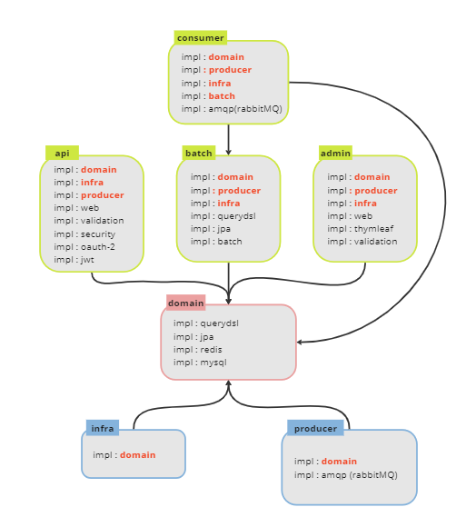

안녕하세요. 냉장고를 부탁해 프로젝트에서 백엔드 개발자를 맡고 있는 김도현입니다.

이번 글에선 저희 프로젝트에서 멀티 모듈을 적용해가는 일화를 소개해드리려고 합니다.

먼저 개인 블로그에 미리 올렸던 글이라는 점 감안해주고 봐주시면 감사하겠습니다. 🙏🙏

앞선 포스팅에서 멀티 모듈 4차까지 진행했고 구성도는 다음과 같다.

### 멀티 모듈 - 5차

그러나 우리는 회의를 통해 서비스의 기능을 확장하기 위해 모듈을 더 추가했다. 모듈 추가의 목적은 RabbitMQ를 통해 비동기 메시지를 사용하는 것과 관리자 웹페이지를 만들어 우리 서비스를 관리하는 것이다. 그래서 우리는 메시지큐 모듈인 mq, 관리자 페이지 모듈인 admin을 추가하게 되었다.

> 확장하고자 하는 상세 기능은 다음과 같다.
> - admin에서 이벤트가 발생하면 비동기로 메시지를 보내고 그 메시지를 받아서 batch가 실행되도록 하는 목적
> - 조회에 사용된 RDB 데이터를 redis에 저장할 때 비동기 메시지로 전송하여 저장하도록 하는 목적 (검토 중)

그러나 애플리케이션을 실행하면서 알게 된 문제인데 domain에 인터페이스를 두고 그를 의존하는 mq와 infra에서 구현체를 만들면 batch와 admin, api에서 애플리케이션 실행시 mq와 infra를 몰라 "domain의 인터페이스의 구현체를 찾을 수 없다"는 오류가 발생한다는 것이었다.

> 위의 그림을 보면 mq에 구현체가 있고 인터페이스는 batch, admin, domain에 있다. 그리고 infra에 구현체가 있고 domain에 인터페이스가 있다.

그래서 이러한 관계에서는 애플리케이션을 실행하는 모듈(api, batch, admin)에서도 bean 스캔시 구현체를 등록하기 위해 의존성에 infra와 mq를 추가해야한다. 따라서 각 모듈의 의존성 구성은 아래의 그림과 같다.

그런데 여기서 문제가 발생한다. mq가 admin과 batch에 메시지를 송수신하기 위해 admin과 batch를 의존성으로 추가했고, admin과 batch에서도 bean 스캔을 위해 infra와 mq의 의존성을 추가했다. 따라서 admin은 mq를 의존하는데 mq도 admin을 의존하고, batch도 mq를 의존하는데 mq도 batch를 의존하는 양방향 의존성이 생긴다.

물론 bean 스캔 때문에 mq를 의존하는 것이라 중간에 domain 있기 때문에 당장 오류가 발생하진 않는다. 하지만 모듈간의 양방향 의존성이 있다는 건 차후에 큰 문제가 생길 수도 있기 때문에 모듈을 한번 더 수정하기로 결정했다.

### 멀티 모듈 - 6차 (현재)

양방향 의존성이 생긴 5차 멀티 모듈에서 우리는 mq를 2개로 분리하기로 했다. mq는 메시지를 전송하는 producer, 메시지를 수신하는 consumer로 구성된다. 그래서 우리는 각각의 쓰임에 따라 모듈을 2개로 분리했다. 아래의 그림이 그 결과이다.

consumer에는 구현체만 있고 이걸 batch의 트리거로 사용하거나 값을 받아 캐시에 저장하는 역할로 사용했다. 따라서 consumer은 domain과 batch를 의존한다. 그렇게 때문에 domain, producer, infra, batch에 의존성을 가지고 있다.

producer는 admin과의 의존성은 없앴다. 어차피 대부분의 기능이 domain을 거쳐서 실행될 것이기 때문에 domain에만 의존하도록 만들었다. 그래서 producer은 아까 mq와 마찬가지로 인터페이스가 domain에 있고 구현체가 producer에 있도록 만들었다.

이와 관련해서 정리한 각각의 모듈의 의존성은 다음과 같다.

이와 같이 변경함으로써 domain과 그 domain을 의존하는 infra, producer가 하나의 의존성으로 묶였고 나머지 애플리케이션 영역이나 consumer가 이걸 의존하도록 되었다. 따라서 의존성의 방향이 하나의 방향으로 설정된 것이다.

> consumer, api, batch, admin -> (domain, infra, producer) 와 같은 구성이다.

### 마치며..

아직 멀티 모듈에 대해서 완벽하게 이해하고 사용하고 있는 것 같진 않다. 그 이유는 멀티 모듈은 기능이 중점이 아니라 설계가 중점이되는 것이기 때문에 뚜렷한 정답이 없다. ~~그래서 이번에 Chat gpt와도 엄청나게 말씨름을 했다.~~ 그래도 이정도면 공부가 많이 된 것 같아서 만족하고 있다.

그러나 멀티 모듈에 대한 공부는 아직 끝나지 않았고 우리 프로젝트에서도 끝나지 않았다. 현재 팀원과 검색 기능과 관련해서 엘라스틱 서치를 도입할 지에 대해서 상의 중이다. 그래서 엘라스틱과 관련해서 모듈을 새로 추가하게 된다면 다음 포스팅에서 설계한 내용을 선보이도록 하겠다.